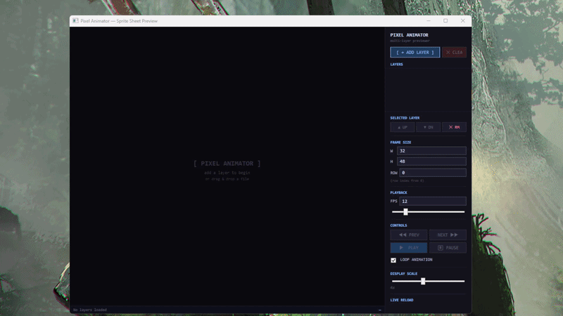

# PixelAnimator

Watching the artist on my team suffer through rebuilding animations after every tiny tweak in Aseprite, I decided to build this tool so she could focus on the actual creative work instead.

This might just be a consequence of our team's own incompetence — maybe a proper way to preview sprite sheet animations already existed and we simply didn't know about it. Either way, the tool is done and I'm putting it out in the open. Maybe it'll help someone beyond just us.

The app shows a live preview of your sprite sheet animation in a separate window. You can switch animation rows, adjust playback speed, stack multiple layers on top of each other, reorder them — and most importantly, the moment you save a PNG file it instantly updates in the preview without reconnecting anything. That alone saves a noticeable amount of time, at least for our team.

Feel free to use it.



---

## Features

- **Multi-layer compositing** — load body, clothes, hair, emotions as separate PNGs and preview them stacked
- **Live reload** — saves in Aseprite instantly update the preview, no manual refresh
- **Layer ordering** — move layers up/down on the fly, fix z-order without touching files
- **Frame stepping** — step through frames manually or play the full animation
- **Adjustable FPS** — slider + input, 1–120 fps
- **Display scale** — 1x to 8x with nearest-neighbor scaling (no blur)
- **Drag & drop** — drop files directly onto the window to add layers

---

## Usage

1. Launch `PixelAnimator.exe`
2. Click **[ + ADD LAYER ]** or drag & drop a sprite sheet PNG
3. Set **frame size** (W/H) and **row index** to match your sheet layout
4. Hit **▶ PLAY** or step through frames manually
5. Keep Aseprite open — the preview updates automatically on every save

### Layer panel

| Button | Action |
|--------|--------|
| `+ ADD LAYER` | Open file dialog (supports multi-select) |
| `▲ UP / ▼ DN` | Move selected layer up or down in z-order |
| `✕ RM` | Remove selected layer |
| `✕ CLEAR` | Remove all layers |

---

## Sprite sheet format

Horizontal strip, one animation per row:

```
[frame 0][frame 1][frame 2]...  ← row 0
[frame 0][frame 1][frame 2]...  ← row 1
```

Set **ROW** index to select which animation row to preview.

---

## Download

See [Releases](../../releases) for prebuilt binaries.
